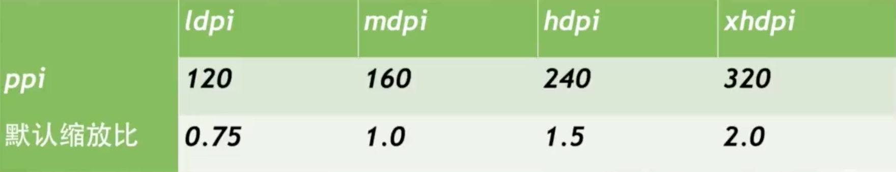
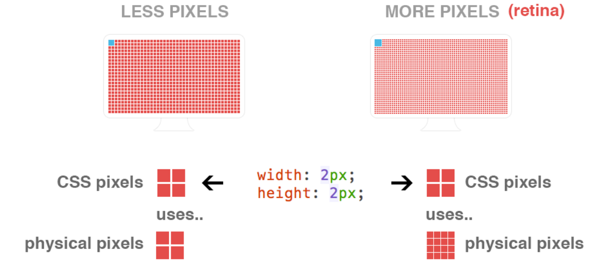

# 像素

### physical pixel

> 一个物理像素是显示器(手机屏幕)上最小的物理显示单元,在操作系统的调度下，每一个设备像素都有自己的颜色值和亮度值。单位pt。

### density-independent pixel

> 设备独立像素也称为密度无关像素，可以认为是计算机坐标系统中的一个点，这个点代表一个可以由程序使用的虚拟像素(比如说CSS像素)，然后由相关系统转换为物理像素。

### css pixel

> 在 CSS、JS 中使用的一个抽象的概念，主要用在浏览器上，单位是 px。
>
> 一般情况之下，CSS像素称为与设备无关的像素(device-independent pixel)，简称DIPs，单位是dp。

### Device Pixel Ratio

> 简称dpr，定义了物理像素和设备独立像素的对应关系

```
设备像素比 ＝ 物理像素 / 设备独立像素  //x,y方向上
window.devicePixelRatio
```

### Pixel Per Inch

> 屏幕每英寸的像素数量，即单位英寸内的像素密度
>
> PPI越高，像素数越高，图像越清晰，即代表显示屏能够以越高的密度显示图像



- 一个🌰

  

  （图侵删）

  在不同的屏幕上(普通屏幕 vs retina屏幕)，css像素所呈现的大小(物理尺寸)是一致的，不同的是1个css像素所对应的物理像素个数是不一致的

  css中的1px并不是代表屏幕上的1px，分辨率越大，css中1px代表的物理像素就会越多，devicePixelRatio的值也越大

## viewport

> 在桌面浏览器中，viewport就是浏览器窗口的宽度高度。但在移动端设备上就有点复杂。
>
> 移动端的viewport太窄，为了能更好为CSS布局服务，所以提供了两个viewport:虚拟的viewport：visualviewport和布局的viewport：layoutviewport。

### visual viewport

> 视觉视口，物理可视化区域

### layout viewport

> iPhone 上的 Safari 使用 980px、Opera 850px，安卓的 Webkit 核心 800px，IE974px。浏览器已经选择好他们的layoutviewport的尺寸，它完整的覆盖了最小缩放模式下的移动浏览器的屏幕。

```document.documentElement.clientWidth/Height```

### ideal viewport

> ideal viewport 的意义在于，无论在何种分辨率的屏幕下，不需要用户手动缩放，也不需要出现横向滚动条，都可以完美的呈现给用户。

## Viewport meta

```<meta name="viewport" content="width=device-width, initial-scale=1.0, maximum-scale=1.0, user-scalable=0">```

- width：layout viewport的宽度，为一个正整数，或字符串"device-width"

- initial-scale：初始缩放比例

- maximum-scale：允许缩放的最大比例

- minimum-scale：允许缩放的最小比例

- user-scalable：是否允许手动缩放

  http://www.cnblogs.com/2050/p/3877280.html

## css单位rem 

> 在[w3c](https://www.w3.org/TR/css3-values/#rem)上是这样描述rem的：
>
> Equal to the computed value of [font-size](https://drafts.csswg.org/css-fonts-3/#propdef-font-size) on the root element. 

🌰：如果html 的font-size是12,一个div的width是1rem,那么这个div的width就是12px;

## rem布局

我们要做的就是：**针对不同手机屏幕尺寸和dpr动态的改变根节点html的font-size大小(基准值)**。

依照某特定宽度设定 rem 值（即 html 的 font-size），页面任何需要弹性适配的元素，尺寸均换算为 rem 进行布局；当页面渲染时，根据页面有效宽度进行计算，调整 rem 的大小，动态缩放以达到适配的效果。

```
rem = px / 基准值;
```

### css媒体查询

> 媒体查询可用于根据设备特点应用样式。

```css
@media mediatype and|not|only (media feature) {
    CSS-Code;
}
html{font-size: 32px;}
//iphone 6 
@media (min-device-width : 375px) {
   html{font-size: 64px;}
}
```

缺点：通过设备宽度范围区间这样的媒体查询来动态改变rem基准值，其实不够精确

### js动态改变<meta>标签

> 在整个手淘团队，有一个名叫[`lib-flexible`](https://github.com/amfe/lib-flexible)的库，而这个库就是用来解决H5页面终端适配的。

```javascript
var metaEl = doc.createElement('meta');
var scale = isRetina ? 0.5:1;
metaEl.setAttribute('name', 'viewport');
metaEl.setAttribute('content', 'initial-scale=' + scale + ', maximum-scale=' + scale + ', minimum-scale=' + scale + ', user-scalable=no');
if (docEl.firstElementChild) {
    document.documentElement.firstElementChild.appendChild(metaEl);
} else {
    var wrap = doc.createElement('div');
    wrap.appendChild(metaEl);
    documen.write(wrap.innerHTML);
}
```

- 动态改写`meta`标签

- 给元素添加`data-dpr`属性，并且动态改写`data-dpr`的值

- 给元素添加`font-size`属性，并且动态改写`font-size`的值

  #### 从视觉稿中的px到rem

  > 目前Flexible会将视觉稿分成100份，而每一份被称为一个单位`a`。同时`1rem`单位被认定为`10a`

  ```
  rem = document.documentElement.clientWidth * dpr / 10
  ```

[使用Flexible实现手淘H5页面的终端适配](https://github.com/amfe/article/issues/17)

### 字体大小问题

我们希望在任何屏幕下字体大小统一，rem并不适合用到文本上，还是使用px作为单位

```css
div {
    width: 1rem; 
    height: 0.4rem;
    font-size: 12px; // 默认写上dpr为1的fontSize
}
[data-dpr="2"] div {
    font-size: 24px;
}
[data-dpr="3"] div {
    font-size: 36px;
}
```

## 参考文章

- http://www.cnblogs.com/skylar/p/mobile.html
- https://segmentfault.com/a/1190000002546941
- http://www.cnblogs.com/2050/p/3877280.html
- http://webdesign.tutsplus.com/zh-hans/articles/quick-tip-dont-forget-the-viewport-meta-tag--webdesign-5972
- https://developer.mozilla.org/zh-CN/docs/Web/Guide/CSS/Media_queries
- http://html-js.com/article/MobileWeb
- https://github.com/riskers/blog/issues/18
- http://www.cnblogs.com/lyzg/p/4877277.html
- http://sentsin.com/web/1212.html